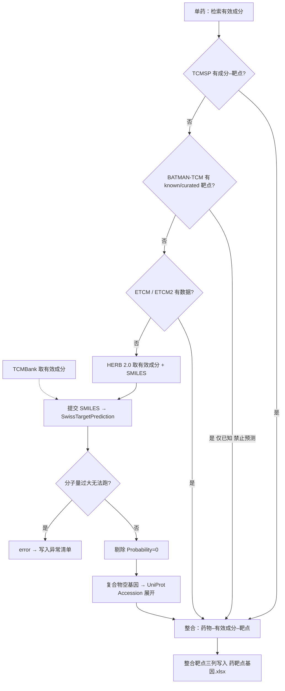

# 网络药理学 / NetworkPharmacology

> **出图约束 SSOT：** [`出图约束_NetworkFigureStandards.md`](文档_docs/出图约束_NetworkFigureStandards.md) — 状态 **`FROZEN`（2026-07-26 用户确认）**；**§J–§L 为 2026-07-27 用户授权增补**（网络分析报告 / 空靶点药味 / 生物结构动画）。未经「解冻」不得改 §A–§H 视觉 recipe、疾病双口径与主 HTML 报告结构。  
> 登记：[`已跑通范式登记_FrozenParadigms.md`](../../00_基础_Foundation/统一可视化规范_VizStandards/文档_docs/已跑通范式登记_FrozenParadigms.md)。

对齐用户交付方法说明《网药数据解读》（20260710）及数据库分类/成分靶点获取 SOP（2026-07）。**禁止**编造基因列表或伪造 STRING 边。

**出图（2026-07 修订）：** STRING PPI 与药–成分–靶–通路网络均可由 **代码/AI（R）绘制**，**不要求** Cytoscape / STRING 网页手绘；Cytoscape 仅作可选精修。库侧 AUTO/MANUAL 见 §1.5。

## 1. 数据来源（分类 SSOT）

三类库**不得混写**：疾病基因库 ≠ 药物/成分–靶点库 ≠ 通路/PPI 库。

### 1.1 疾病数据库（六库）

前五个为交付主库；**DisGeNET** 一并纳入疾病侧检索。均按**英文病名**检索/导出。

| # | 数据库 | 官网 | 产出 |
|---|--------|------|------|
| 1 | GeneCards | https://www.genecards.org/ | `疾病靶点_GeneCards.csv` |
| 2 | TTD | https://db.idrblab.net/ttd/ | `疾病靶点_TTD.csv` |
| 3 | DrugBank | https://go.drugbank.com/ | `疾病靶点_DrugBank.csv` |
| 4 | OMIM | https://www.omim.org/ | `疾病靶点_OMIM.csv` |
| 5 | CTD | https://ctdbase.org/ | `疾病靶点_CTD.csv` |
| 6 | DisGeNET | https://disgenet.com/ | `疾病靶点_DisGeNET.csv` |

疾病多库韦恩使用**完整 GeneCards**（`venn_uses_full_genecards=true`）；下游交集/富集/网络用 Relevance≥40 过滤集再与其他库并集。详见出图约束 **§0a 疾病基因双口径**（禁止把全量 7000+ 与药病交集几百混为一谈）。

### 1.2 药物 / 成分–靶点数据库

| 数据库 | 官网 | 用途 |
|--------|------|------|
| **TCMSP** | https://tcmsp-e.com/ | 优先：有效成分（OB≥30%, DL≥0.18）+ 成分–靶点 |
| **BATMAN-TCM** | http://bionet.ncpsb.org.cn/batman-tcm/#/search | 仅取 **known/curated 已知靶点**；**禁止**用 BATMAN 预测靶点 |
| **ETCM / ETCM2** | http://www.tcmip.cn/ETCM2/front/#/ | 成分–靶点补充 |
| **HERB 2.0** | http://herb.ac.cn/（chedi API） | 有效成分 + **SMILES**；无 curated 成分靶点时交 SwissTargetPrediction |
| **SwissTargetPrediction** | https://swisstargetprediction.ch/ | SMILES→人源靶点；**剔除 Probability=0**；细则见 [`文档_docs/成分靶点获取与交付规范_CompoundTargetSOP.md`](文档_docs/成分靶点获取与交付规范_CompoundTargetSOP.md) |
| **TCMBank** | https://tcmbank.cn/ | 可取药物有效成分，再走预测（SwissTargetPrediction） |

### 1.3 通路 / PPI（非疾病库、非草药成分库）

| 平台 | 官网 | 用途 |
|------|------|------|
| **KEGG** | https://www.kegg.jp/ | 通路富集与官方通路图；网络 D 层 |
| **STRING** | https://string-db.org/ | 蛋白–蛋白互作（交集基因 PPI） |

### 1.4 阶段总表

| 阶段 | 数据库 / 平台 | 粒度 | 产出 |
|------|---------------|------|------|
| 药物列表 | 项目表 `药物中文名称.xlsx` | **单药一行** | 待检索中药名列表 |
| 成分 + 靶点 | §1.2 瀑布（TCMSP→BATMAN→ETCM→HERB/TCMBank→SwissTargetPrediction） | **每药一份** | `HERB_{药}_*.csv` + `{药}靶点基因.xlsx`（整合靶点三列，见 §4.1.1） |
| 靶点基因补全 | UniProt reviewed human（**仅**补 STP 复合物空 Common name） | 每药 | 写入整合表基因列；**禁止**全蛋白组左拼交付 |
| 疾病基因 | §1.1 六库 | **按英文病名各库一份** | `疾病靶点_{DB}.csv` |
| 整合 | 本地 | 全药去重 + 多库并集 + 全药∩疾病 + **每药∩疾病** | 见 §4 |
| PPI | STRING **API 自动** → **代码绘制**（非手绘） | 交集基因 | `PPI互作_StringInteractions.tsv` + `网络图_StringPPI_*` |
| 富集 | Metascape（GO）/ 生物医学数据分析盒子或 clusterProfiler（KEGG REST 可辅助） | 交集基因 | GO/KEGG 表与图 |
| 多层网络 | **代码/AI 绘制**（`np_plot_hctp_network`）；Cytoscape 可选 | network.csv + type.csv（A/B/C/**D**） | `网络图_HerbCompoundTargetPathway_*` |

### 1.5 自动取数 vs 需你手工配合（实测 2026-07-19）

| 能力 | 库 / 平台 |
|------|-----------|
| **AUTO — 代码可拉** | CTD curated bulk；KEGG REST；STRING API；Open Targets GraphQL（陪跑）；**HERB chedi API**；**SwissTargetPrediction** 表单提交（locate→predict→result，可达时） |
| **MANUAL — 需你导出** | GeneCards、TTD、DrugBank、OMIM、DisGeNET；TCMSP、BATMAN（known）、ETCM2、TCMBank；STP/HERB 在 AUTO 失败时回退手工 |
| **出图 AUTO** | PPI 同心/Degree 图、HCTP 多层网络、韦恩/柱/GO/KEGG 表驱动图（有表即可） |

异常配合清单见 §4.1（`异常清单_CompoundTargetExceptions.csv`）。

本库样例：`data_provenance: REAL` —— **用户交付、已按英文病名与单药导出的中间表**（疾病/草药库多数非本机自动爬虫；CTD/STRING/KEGG 可程序化）。见 `PROVENANCE.json` 的 `disease_english_name`。

## 2. 数据规范

- 输入必须可溯源到：**单药名** + **英文病名** + 具体库导出文件；禁止把多药揉成一张无 herb 维度的「假单表」当作唯一输入而不保留单药文件。
- **最终范式不变式**：无论成分–靶点来自哪一库，整合后 schema 一律为 **药物–有效成分–靶点**（drug–compound–target），再与疾病基因/通路衔接。
- **HERB→STP 交付精简**：只保留 HERB 匹配表 + 各成分 Swiss 明细 + **整合靶点**（`成分 | Protein names | Gene Names (primary)`）。详见 [`成分靶点获取与交付规范_CompoundTargetSOP.md`](文档_docs/成分靶点获取与交付规范_CompoundTargetSOP.md)。
- **禁止**把 UniProt reviewed 全表（约 2 万行）左拼进 `{药}靶点基因` 当主交付（历史「白术式」左栏仅作可选对照，非 STP 路径默认）。
- 列契约见 `脚本_scripts/01_契约接口_DataContracts.R`。
- `STATUS` / 审计 / `DATA_SOURCE.md` 必须写 `data_provenance` 与图册完成度（`PARTIAL` 允许；**禁止假全流程 PASS**）。
- 本环境 **不** 登录爬取 TCMSP/GeneCards 等；缺导出则该步 `BLOCKED_EXTERNAL`，不得编造基因列表。
- SwissTargetPrediction 分子量过大无法运行 → 记入 **异常清单**（§4.1），不得静默丢弃或编造靶点。

## 3. 何时选用

- 中药/复方：单药成分–靶点–疾病网络与通路解释。
- 山水用途层：药物–基因。
- 下游：蛋白结构 → 分子对接 → MD。

不适用：仅 bulk DEG；仅 PPI 无成分层（用 `蛋白质互作网络_PPI-Network`）。

## 4. 数据处理方法（严谨流水线）

```
1. 列出单药中文名
2. 每药：按 §4.1 瀑布获取有效成分→靶点 → UniProt 标准化 → {药}靶点基因
   （整合 schema 恒为 药物–有效成分–靶点；异常写入异常清单）
3. 英文病名（例：Atherosclerosis）分别在 GeneCards / TTD / DrugBank / OMIM / CTD / DisGeNET 导出疾病靶点
4. 疾病多库基因集 → 韦恩图 + 并集「疾病基因」
5. 全药靶点去重 → 「药物去重基因」；与疾病基因 → 韦恩图 + 「药物疾病交集靶点」
6. 每药靶点 ∩ 疾病基因 →「{药}_与疾病基因交集」及去重表；汇总重复有效成分命名表
6b. 六味靶点基因表 × 重命名表 × 药病交集 →「成分疾病交集靶点」边表/汇总；可选导出 Cytoscape 边/节点表
7. 构建 network.csv 与 type.csv：**A药–B成分–C靶点–D通路**（C–D 来自 KEGG 富集 geneID）
8. 交集基因 → STRING API（`get_string_ids` + `network`）→ 缓存 TSV → **代码绘制 PPI 图**（无需软件手绘）
9. 交集基因 → Metascape GO / KEGG 富集 → 表驱动出图；KEGG REST 可辅助；官网 Top 通路位图可选下载
10. **代码绘制多层网络**（`np_plot_hctp_network`）；Cytoscape 仅可选精修，**非交付必做**
11. 审计报告 + PlotQA + 图册对账；交付异常清单（若有）
```

快速只出网络图：`01_样例_sample/代码文件/02_run_network_preview.R`。

### 4.1 单药成分→靶点获取瀑布（权威 SOP）

对**每一味药**的有效成分→靶点，按下列优先级**串行回退**（有数据即停在该层，不再往下预测替代；TCMBank 可与 HERB 路径并行用于取成分）：



**逐步规则：**

1. **TCMSP 优先** — 检索单药；成分筛选 OB≥30%、DL≥0.18；有成分–靶点则采用并进入整合。
2. TCMSP 无数据 → **BATMAN-TCM**：只拉取 **known/curated 已知靶点**；**不得**使用 BATMAN 的预测靶点。
3. BATMAN 无已知靶点 → **ETCM / ETCM2**。
4. ETCM 仍无 → **HERB 2.0**：收集有效成分；从 HERB 取得 **SMILES** → 提交 **SwissTargetPrediction**（Homo sapiens）做预测靶点。
5. **TCMBank** 路径：亦可用于获取药物有效成分，再视需要走 SwissTargetPrediction 预测。
6. **过滤**：剔除 Probability = 0（或等价零分）；**必须执行该过滤**（即使某次返回中 0 分行为 0 条，也要在规范说明中写明「已滤 / 删除 N 条」）。
7. **空 Common name**：STP 对多亚基复合物常留空基因、Uniprot 为 `A&B&…` → Swiss 明细保留；整合表用 UniProt reviewed **展开为基因**；无法映射则不入整合表（禁止空基因进入下游）。
8. 分子量过大导致 SwissTargetPrediction **无法运行** → 记为 **error**，写入 **异常清单** 交用户；不得编造靶点。
9. **不变式**：整合 schema = **药物–有效成分–靶点(基因)**；交付见 §4.1.1。

### 4.1.1 HERB→STP 交付结构（精简，强制）

完整条文：[`文档_docs/成分靶点获取与交付规范_CompoundTargetSOP.md`](文档_docs/成分靶点获取与交付规范_CompoundTargetSOP.md)。

| 保留 | 不保留（除非用户另要） |
|------|------------------------|
| `HERB_{药}_有效成分.csv`、`HERB_{药}_靶点明细.csv` | UniProt 全表左拼的巨型 `{药}靶点基因` |
| **`{英文名}_Swiss预测靶点_筛选前.csv`** 与 **`_筛选后.csv`**（每成分各两份） | 含糊的 `Swiss_*` / 不分筛选阶段的单文件冒充终稿 |
| `{药}靶点基因.xlsx`：`整合靶点` + 同上命名的 Swiss 表 + HERB 表 | 空异常清单、未请求的疾病交集旁路文件 |

**Swiss 命名（强制）：** `{compound_en}_Swiss预测靶点_筛选前|筛选后.csv`；筛选后 = Probability>0；即便 0 分行数为 0 也要两套文件并存。

**预测方式（程序化要点）：** `POST locate.php` → `POST predict.php`（`organism=Homo_sapiens`, SMILES）→ 解析 `result.php?job=`；失败则 MANUAL 导出。

**异常清单（exception list）列约定：**

| 列名 | 含义 |
|------|------|
| `drug` | 单药中文名 |
| `compound` | 有效成分名（若已解析） |
| `SMILES` | 已取得的 SMILES（无则空） |
| `MW` | 分子量（若已知） |
| `source_attempted` | 已尝试的库/步骤（如 `HERB→SwissTargetPrediction`） |
| `error_reason` | 如 `MW_too_large_for_SwissTargetPrediction` / `no_targets_in_TCMSP_BATMAN_ETCM` |
| `timestamp` | ISO 时间戳 |

建议文件名：`异常清单_CompoundTargetExceptions.csv`。

### network.csv / type.csv 规则（写死）

- `network.csv`：边表两列；**A–B**（药–成分）、**B–C**（成分–交集靶点）、**C–D**（靶点–KEGG 通路 `hsa*`）。
- `type.csv`：A=药物，B=有效成分，C=靶点，**D=KEGG 通路**。

## 5. R 包与软件栈

| 步骤 | 工具 | 作用 | 样例状态 |
|------|------|------|----------|
| 契约读写 / 交集 / 韦恩数据 | base R | CSV | R 可复现 |
| 韦恩图 | `ggVennDiagram`（或 VennDiagram） | 多库/药病韦恩 | R 可复现（必做） |
| 单药交集柱图、成分交集柱图、GO/KEGG | ggplot2 + VizStandards | 表驱动图 | R 可复现 |
| 药–成分–靶–通路网络 | **代码/AI 绘制**（可选 Cytoscape） | Degree 大小 + 分层色 | 样例 `PASS`（R） |
| STRING PPI 网络 | STRING **API** + 代码绘制 | Degree→色/大小/环字号 | 样例 `PASS`（API 已测通） |
| GO 原始分析 | Metascape | BP/CC/MF | 外部；样例用预计算表 |
| KEGG 圈图等 | **circlize**（样例）/ 生物医学数据分析盒子 | 基因–通路 chord | R 可复现（需 geneID） |
| KEGG 列表/通路元数据 | KEGG **REST** | 程序化 | `AUTO` |
| KEGG 官方通路位图 Top10 | KEGG 官网 Download | 位图 | 可选手工 / `BLOCKED_EXTERNAL` 仅针对位图 |

## 6. 交付图册 × 实现状态（强制对账）

### 网络图出图约束（最终约定 SSOT）

药–成分–靶–通路（HCTP）与 STRING PPI 同心图的**最终约定**见：

[`文档_docs/出图约束_NetworkFigureStandards.md`](文档_docs/出图约束_NetworkFigureStandards.md)

**代码 SSOT：** `脚本_scripts/04_交付网络布局_DeliveryNetworkLayouts.R`（覆盖 `03_*` 的 plot helpers）。摘要：

| 交付图（轨 B 中文） | 轨 A | 硬约束摘要 |
|--------------------|------|------------|
| KEGG圈图 / KEGG圈图基因名 | 10 | 半圆连续；通路全称禁省略；标签不互挡；约 13×11 in |
| 药物有效成分疾病靶点通路网络图（+椭圆布局） | 11（+12） | Degree→size **60–120**；描边 `transparent`；C–D 蓝；靶点圆角方浅粉；**通路用 hsa 编号**；**靶点全标不空白**（加距防叠）；columns ×**1.30**；ellipse 间隙 **≥0.5 cm**；字号类型内恒定 |
| PPI渐变图（+_Degree） | 14（+15） | score≥0.9；**topDegree≤200**；环布局；标签不互挡；副标题含 n/e |
| string_vector_graphic | 13 | STRING 官网陪跑（外网失败 → `BLOCKED_EXTERNAL`） |
| 流程 | — | **代码出图为交付默认**；Cytoscape 可选；文档 **`FROZEN`（2026-07-26）** |

配色与版式强制对齐：
- 全局：`theme_journal()` + `bioinfo_npg` / 分组绿红紫（VizStandards）
- 网药交付参考：`01_样例_sample/参考_交付原图/`（自 `D:\网络药理学文件\交付文件\图片`）

| 交付图 | 实现状态 | 如何操作（缺图时） |
|--------|----------|-------------------|
| 疾病数据库可视化韦恩图 | **交付原图（样例）** / 微生信模板重绘 | 样例：微生信 SVG → `_export_delivery_venn_figures.py`。新项目：上传分库基因到微生信；或用 `09_build_weishengxin_style_venn.py`（样例 SVG 模板+本项目数据）写入交付位。`np_plot_*_venn` 仅为缺图近似，不得标 DONE |
| 疾病药物交集韦恩图 | **R 可复现** | 药物去重基因 vs 疾病并集 |
| 单药∩疾病靶点数 | **R 可复现** | 各 `{药}_与疾病基因交集` 计数柱图 |
| 成分×药病交集靶点表 + 均分/按药子图 | **R 可复现** | 均分排名子图 `CompoundDiseaseOverlap`；按药分面 `CompoundDiseaseOverlapByHerb`（大约再拆）；水平柱、每面板异色；仅化学名。**柱区（红框）全图等宽对齐**：gtable 钉死 `axis-l` + `panel` 绝对宽（共用 `lab_width`）；长名折行，不挤柱区 |
| GO BPCCMF 柱/气泡 | **R 可复现**（有结果表） | Metascape 导出后用本技能脚本重绘 |
| KEGG 柱/棒棒糖/气泡 | **R 可复现**（有结果表） | clusterProfiler 或盒子导出 CSV 后重绘 |
| KEGG 圈图 / 圈图基因名 | **R 可复现**（`circlize`，需 `geneID`） | `np_save_kegg_chord` → `圈图_KEGG_Circos`；无 geneID 时才断点 |
| KEGG 官方通路图 Top20 | **REST 可下** | `24_download_kegg_pathway_maps.py` → `图片/KEGG官方通路图/`；学术遵守 KEGG 条款 |
| 药味成分 UpSet / 桑基 / 药味×通路热图 | **R 可复现** | Fig 16–19；见出图约束 §E |
| HTML 交付报告 | **脚本生成** | 根目录 `图注与解读说明.html`；相对路径；整夹分享 |
| HCTP 网络分析报告 | **脚本生成** | `32_export_cytoscape_network_analysis.py` → `数据/网络图/网络图数据.csv` + `网络分析报告.html`；成分显示原名；出图约束 **§J** |
| 空靶点药味说明 | **必注** | 如肉桂=0：BLOCKED_EXTERNAL，禁止假靶点；**§K** + 成分靶点 SOP §7 |
| 人体生物结构动画 | **可选示意** | `图片/动画_生物结构/`；插画底图+GIF；**§L**；非 KEGG 拓扑复刻 |
| 药物有效成分疾病靶点通路网络图 | **代码/AI 可绘（交付默认）** | `02_run_network_preview.R` / `np_plot_hctp_network`；**无需** Cytoscape 手绘 |
| STRING PPI 网络图 | **STRING API + 代码可绘（交付默认）** | `np_fetch_string_ppi` + `np_plot_string_ppi`；**无需**网页/Cytoscape 手绘 |
| Cytoscape 精修（可选） | Cytoscape 3.10.2 | 非必做；仅当用户要 `.cys` 交互工程时见下方 SOP |

### Cytoscape SOP — 成分网络图

1. 安装 Cytoscape 3.10.2。  
2. File → Import → Network from File：优先样例导出的 `网络边_CompoundGene_Cytoscape.csv`（或全量 `网络边_network.csv`）。  
3. Import → Table：`网络节点_CompoundGene_Cytoscape.csv`（或 `网络节点类型_type.csv`），按节点名匹配属性 A/B/C。  
4. Style：按 Degree 映射节点 Width/Height（min 60, max 120）；连续色映射 Degree。  
5. 导出 SVG → 交付名建议 `网络图_HerbCompoundTarget_Cytoscape.svg`。

刷新成分–交集表（交付盘可用时）：

```text
python 网络药理学_NetworkPharmacology/_prepare_compound_overlap_from_delivery.py
```

再运行 `01_样例_sample/代码文件/01_run_sample.R`。

样例目录约定（raw=`数据文件/`；结果=`代码文件/结果文件/`；文件流水线编号）：见 DeliveryStandards [`样例目录与命名_SampleLayoutNaming.md`](../../00_基础_Foundation/统一交付规范_DeliveryStandards/文档_docs/样例目录与命名_SampleLayoutNaming.md)。

### Cytoscape SOP — PPI 渐变图

1. STRING 上传「药物疾病交集」基因列表，物种 Homo sapiens，导出 `string_interactions_short.tsv`。  
2. Cytoscape 导入该 tsv → Tools → Analyze Network。  
3. Degree 映射大小 60–120、连续颜色；导出 `PPI渐变图` SVG 与节点表 CSV；保存 `.cys`。

### 疾病库按英文病名导出 SOP（摘要）

1. 确定**英文病名**（样例动脉粥样硬化：`Atherosclerosis`；测试肺癌：`lung cancer` / MeSH `Lung Neoplasms` / `MESH:D008175`）。  
2. GeneCards：检索英文病名 → 导出 Results CSV（无公开批量 API；浏览器导出）。  
3. TTD / DrugBank / OMIM / CTD / **DisGeNET**：同样以**英文病名**检索并导出靶点/基因列（DisGeNET：https://disgenet.com/）。  
4. DrugBank 靶点与 UniProt reviewed human 匹配后保存 `Drugbank靶点数据.csv`。  
5. 将各库 gene symbol 标准化后做韦恩与并集。

**配置 / 断点（与 2026-07-19 网址实测一致）：**

| 库 | 自动拉取 | 说明 |
|----|----------|------|
| GeneCards / DrugBank / OMIM | **否**（403 或需登录） | 请你浏览器导出；缺文件 → `BLOCKED_EXTERNAL`，禁止编造 |
| TTD / DisGeNET / TCMSP / BATMAN / ETCM2 / TCMBank | **否**（页可达或仅表单，无稳定公开 API） | 请你按瀑布导出；TCMBank 优先 **http://tcmbank.cn/** |
| HERB 2.0 | **是（chedi API，可达时）** | search/detail；失败 → MANUAL |
| SwissTargetPrediction | **是（表单提交，可达时）** | locate→predict→result；滤 Probability=0；失败 → MANUAL |
| OMIM API | 可选 | https://www.omim.org/api → `OMIM_API_KEY` |
| CTD | **是（bulk）** | `CTD_curated_genes_diseases.tsv.gz` 实测可下 |
| KEGG REST / STRING API | **是** | 通路列表与 PPI 边可程序化；网络图代码绘制 |
| OpenTargets | 陪跑 | GraphQL 可用；**非**交付主疾病库 |

### 单药成分–靶点导出 SOP（摘要）

完整瀑布见 **§4.1**。操作要点：

1. **TCMSP** 检索单药 → OB≥30%、DL≥0.18 → 参数表 + 成分靶点（有则结束本药获取）。  
2. 无 → **BATMAN-TCM**（http://bionet.ncpsb.org.cn/batman-tcm/#/search）仅 **known** 靶点。  
3. 无 → **ETCM2**（http://www.tcmip.cn/ETCM2/front/#/）。  
4. 无 → **HERB 2.0** 取成分与 SMILES → **SwissTargetPrediction**（Homo sapiens）；**TCMBank** 可作成分来源后同走预测。  
5. 剔除 Probability=0；复合物空基因用 UniProt Accession 展开；MW 过大 → `异常清单_CompoundTargetExceptions.csv`。  
6. 交付 `{药}靶点基因.xlsx`（整合三列 + 各成分 Swiss）；**不做** UniProt 全表左拼。schema = 药物–有效成分–靶点(基因)。

## 7. 数据结果解读

- 多库并集提高召回、抬高假阳性；须报告交集策略作敏感性分析。  
- 中心性 ≠ 因果；须实验/临床正交验证。  
- 样例 REAL 中间表仍是**演示**，非诊疗建议。

## 8. 与其它技能

- 强制：`统一可视化规范_VizStandards`、`统一交付规范_DeliveryStandards`、`数据真实性验证_DataAuthenticity`。  
- **出图后审核：** 项目级 PlotQA（[`出图后审核_PlotQA.md`](../../00_基础_Foundation/统一可视化规范_VizStandards/文档_docs/出图后审核_PlotQA.md)）；网药网络布局在 `04_交付网络布局_DeliveryNetworkLayouts.R` 调用 `viz_qa_network_nodes`，**不**另建 NetPharm-only 遮挡规范。网络专属样式见 [`文档_docs/出图约束_NetworkFigureStandards.md`](文档_docs/出图约束_NetworkFigureStandards.md)。  
- 下游：`蛋白结构与建模` → `分子对接` → `分子动力学`。  
- 对接信息表来自 PPI Degree 筛选（见交付分子对接流程）。

## 样例验证

路径：`01_样例_sample/`。  
`STATUS.txt` 期望：`PARTIAL` 当且仅当仍缺**手工库导出**或 KEGG **官网位图**等外部步骤；**PPI / HCTP 网络图不得再标 `BLOCKED_EXTERNAL`**（代码可绘）。缺 GeneCards 等导出时该步 `BLOCKED_EXTERNAL`，**不得**假全流程 `PASS`。
